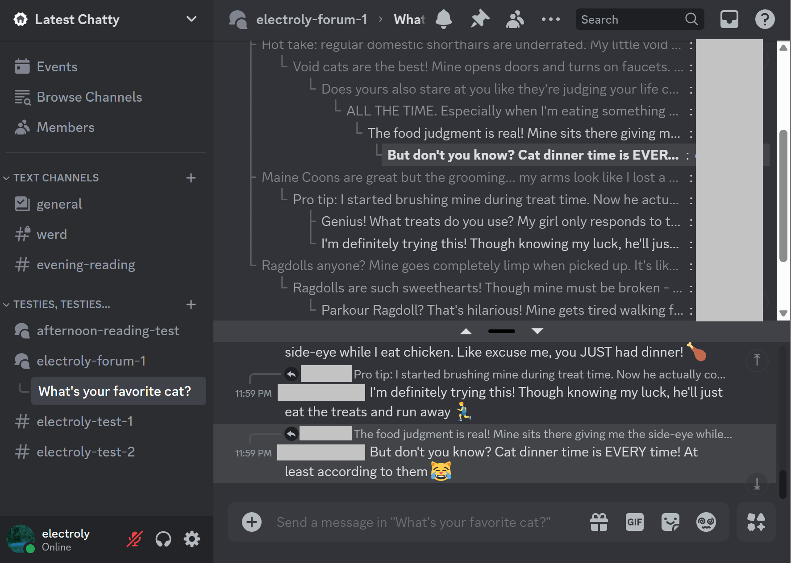

<h1 align="center"><br>Threadloaf</h1>

Threadloaf is a Chrome extension that enhances Discord with a hierarchical tree view of messages.



## Features

- **Split View**: View the thread tree on the top and the chat on the bottom.
- **Message Threading**: Automatically organizes messages into threaded conversations based on replies and timing.
- **Visual Hierarchy**: Recent messages are highlighted with brighter colors, making it easy to track new activity.
- **Quick Navigation**: Click any message in the thread view to instantly jump to it in the chat view, and vice versa.
- **Visual Feedback**: Messages are highlighted when clicked to help you track where you've jumped to.
- **Message Preview**: See message previews in a compact format that maintains readability.

## Installation

1. Install the extension from the Chrome Web Store (link coming soon).
2. Click the extensions button in the browser toolbar to access the Threadloaf options.
3. Visit Discord.

## Build from Source

To build the extension from source:

1. Clone the repository
2. Navigate to the `src` directory
3. Install dependencies:
   ```bash
   npm install
   ```
4. Build the extension:
   ```bash
   npm run build
   ```

The built extension will be available in the `dist` directory. You can then load it as an unpacked extension in Chrome by:
1. Going to `chrome://extensions`
2. Enabling "Developer mode"
3. Clicking "Load unpacked" and selecting the `dist` directory
