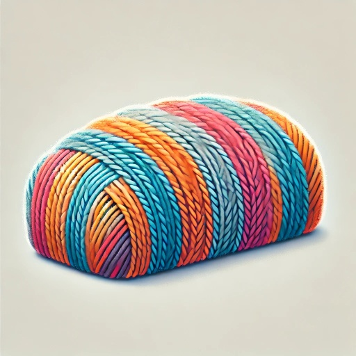

# Threadloaf

Threadloaf is a Chrome extension that enhances Discord's thread view with a more intuitive and readable interface.

## Features

- **Thread View**: Toggle between traditional chat view and an enhanced thread view with a single click
- **Message Threading**: Automatically organizes messages into threaded conversations based on replies and timing
- **Visual Hierarchy**: Recent messages are highlighted with brighter colors, making it easy to track new activity
- **Quick Navigation**: Click any message in the thread view to instantly jump to it in the chat view
- **Visual Feedback**: Messages are briefly highlighted when clicked to help you track where you've jumped to
- **Rich Content Support**: Fully supports Discord's rich content including emojis, images, and embeds
- **Message Preview**: See message previews in a compact format that maintains readability
- **Adjustable Split**: Drag to resize the thread view and chat view to your preferred proportions

## Installation

1. Install the extension from the Chrome Web Store (link coming soon)
2. Visit Discord in your Chrome browser
3. Look for the "Chat/Thread" toggle button at the top of any channel

## Usage

### Basic Navigation

- Click the "Thread" button to switch to thread view
- Click any message preview to instantly jump to that message in the chat view
- Drag the splitter bar to adjust the size of the thread and chat views
- Click the "Chat" button to return to Discord's standard chat view

## Build from Source

To build the extension from source:

1. Clone the repository
2. Navigate to the `src` directory
3. Install dependencies:
   ```bash
   npm install
   ```
4. Build the extension:
   ```bash
   npm run build
   ```

The built extension will be available in the `dist` directory. You can then load it as an unpacked extension in Chrome by:
1. Going to `chrome://extensions`
2. Enabling "Developer mode"
3. Clicking "Load unpacked" and selecting the `dist` directory
